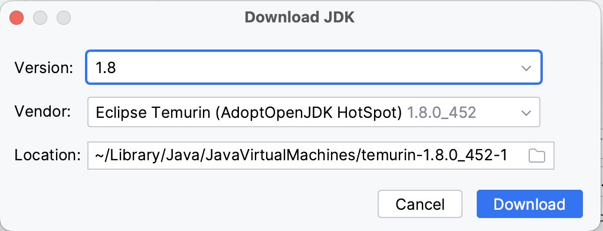

  

    <em>Decentralized utility management made simple. Manage customers, revenues and assets with this all-in one open source platform.</em>

  
  
  

---

# MicroPowerManager - Customer Registration App

MicroPowerManager (MPM) is a decentralized utility and customer management tool.
Manage customers, revenues and assets with this all-in one Open Source platform.

## Get Started

This repository contains the source code for the [MicroPowerManager Customer Registration App](https://micropowermanager.io/usage-guide/android-apps.html).

### Prerequsites

- Install [Android Studio](https://developer.android.com/studio)
- Git clone the repository

### Build the app

To build the app

- Open the project in Android Studio
- Configure `AdoptOpenJDK 8 HotSpot` as Gradle JDK.

  - Open Setting (**Android Studio > Settings > Build, Execution, Deployment > Build Tools > Gradle**)
  - If not installed yet, select **Download JDK...** from the **Gradle JDK** dropdown and select

    | Field    | Value                                    |
    | -------- | ---------------------------------------- |
    | Version  | `1.8`                                    |
    | Vendor   | `Eclipse Temurin (AdoptOpenJDK HotSpot)` |
    | Location | `<default>`                              |

    

  - If already installed, select **temurin-1.8** from the **Gradle JDK** dropdown

- Click **Sync Project with Gradle files**
