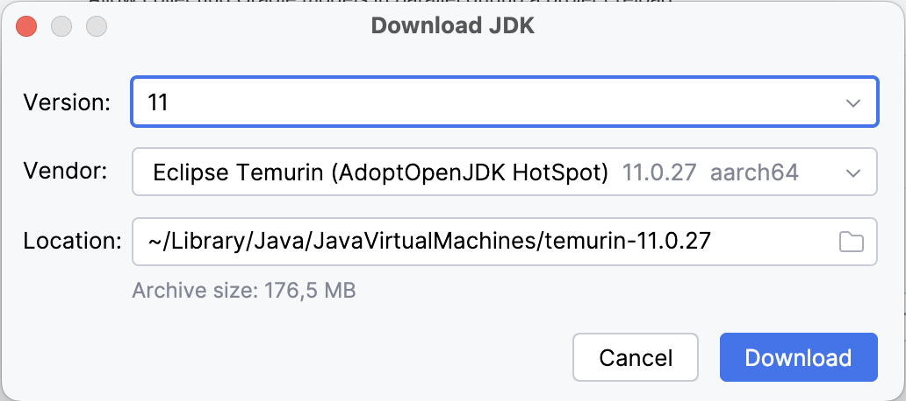

<p align="center">
  <a href="https://github.com/EnAccess/micropowermanager-customer-registration-app">
    
  </a>
</p>
<p align="center">
    <em>Decentralized utility management made simple. Manage customers, revenues and assets with this all-in one open source platform.</em>
</p>
<p align="center">
  
  
  <a href="https://github.com/EnAccess/micropowermanager-customer-registration-app/blob/main/LICENSE" target="_blank">
    
  </a>
</p>

---

# MicroPowerManager - Customer Registration App

MicroPowerManager (MPM) is a decentralized utility and customer management tool.
Manage customers, revenues and assets with this all-in one Open Source platform.

## Get Started

This repository contains the source code for the [MicroPowerManager Customer Registration App](https://micropowermanager.io/usage-guide/android-apps.html).

### Prerequsites

- Install [Android Studio](https://developer.android.com/studio)
- Git clone the repository

### Build and run the app locally

To build the app

- Open the project in Android Studio
- Configure `temurin-11` as Gradle JDK.

  - Open Setting (**Android Studio > Settings > Build, Execution, Deployment > Build Tools > Gradle**)
  - If not installed yet, select **Download JDK...** from the **Gradle JDK** dropdown and select

    | Field    | Value                                  |
    | -------- | -------------------------------------- |
    | Version  | `11`                                   |
    | Vendor   | `Eclipse Temurin AdoptOpenJDK HotSpot` |
    | Location | `<default>`                            |

    

    **NOTE:** For ideal performance be sure to select the correct architecture.
    For example for users of Mac's with M-chips select `aarch64`.

  - If already installed, select **temurin-11** from the **Gradle JDK** dropdown

- Click **Sync Project with Gradle files**

**Run on a Device or Emulator:**

- Minimum `minSdkVersion` is 21 (Android 5.0).
- The app uses location permissions, so ensure the emulator or device has **Google Play Services** and location set up.

### Create a release APK locally

To create a release APK locally

1. Open a terminal and confirm `$JAVE_HOME` is set correctly.
2. Run

   ```sh
   ./gradlew assembleRelease
   ```

3. The output APK will be located at `app/build/outputs/apk/release`

### Development setup

If you plan to develop and contribute a few additional steps are recommended

- Install [Intellij ktlint Plugin](https://plugins.jetbrains.com/plugin/15057-ktlint)
- Enable [Intellij ktlint Plugin](https://plugins.jetbrains.com/plugin/15057-ktlint) plugin.
  - Open Setting (**Android Studio > Settings > Tools > KtLint**)
  - Select `Mode > Distract free (recommended)`
  - Select `Ruleset version > 1.5.0`
- Install [direnv](https://direnv.net/)
- Copy `.envrc.sample` to `.envrc` and adjust `JAVA_HOME=` to match the
  Gradle JDK path from above.

## Architecture

The app uses a **single-activity**, **MVVM**-based architecture with

- **Koin** for Dependency Injection
- **Room** for local persistence
- **RxJava** for reactive data flows.

### MVVM Layers

- **View** Fragments/Activities handling UI interactions (e.g., `AddCustomerFragment`).
- **ViewModel** Classes like `AddCustomerViewModel` expose data to the UI and orchestrate calls to repositories.
- **Repository / Model** Data retrieval and business logic (e.g., `AddCustomerRepository`) using both **Room** (for local DB) and **Retrofit** (for network).

### Dependency Injection (Koin)

All dependencies (ViewModels, Repositories, Retrofit clients, etc.) are declared in **Koin** modules.

### Network Layer

- **Retrofit** with qualifiers for Auth (`AuthNetworkModule`) and No-Auth (`NoAuthNetworkModule`).
- **OkHttp** interceptors handle logging, authorization headers, content-type, etc.
- Base URL can be changed dynamically using `SharedPreferenceWrapper`.

### Room Database

- Local offline storage using Room (class: `InensusDatabase`) with a single table for customers (`CustomerDao`).
- Simple DAO operations (insert, update, delete, getCustomerList) in `CustomerDao`.

### Single-Activity Navigation

- `MainActivity` hosts all screens and toggles them with fragment transactions (show/hide).
- `SplashActivity` and `LoginActivity` are additional specialized activities (e.g., for onboarding/login).
- **Bottom Navigation** is used to switch between major features in `MainActivity`.

### Broadcast Receivers

- `ConnectivityBroadcastReceiver` monitors network changes and updates `ConnectionChecker`.
- `SessionExpireBroadcastReceiver` triggers forced logout if the user's session is invalid.

## Feature Modules

Below are the app's main features and their responsibilities:

### Login

- **Purpose**: Allows user to authenticate.
- **Activity**: `LoginActivity`.
- **Data**: Credentials stored via `SharedPreferenceWrapper`.

### Adding Customers

- **Purpose**: Lets user create a new customer entry.
- **Fragment**: `AddCustomerFragment`.
- **Implementation**:
  - Fetches additional data (manufacturer, meter types, etc.) if online.
  - Stores the new customer in the local DB using `CustomerDao`.

### Customer List

- **Purpose**: Displays customers stored locally.
- **Fragment**: `CustomerListFragment`.
- **Implementation**:
  - Queries `CustomerDao` for all entries.
  - (Optionally) syncs local data with a remote server (if implemented).

### Offline In-App DB

- **Purpose**: Works without internet.
- **Tech**: [Room Database](https://developer.android.com/training/data-storage/room).
- **Location**: `InensusDatabase`, `CustomerDao`.

## Development Notes

- **RxJava**:
  - Observed in `AddCustomerFragment`, `CustomerListFragment`, etc.
  - Uses `CompositeDisposable` in `BaseViewModel` for cleanup.
- **Deprecated APIs**:
  - `AsyncTask` for DB inserts, `GoogleApiClient` for location.
  - Migrate to coroutines and `FusedLocationProviderClient` if maintaining long term.
- **Permissions**: Location permission is handled manually in `AddCustomerFragment`.

## Feature Workflows (PM-Focused)

### Add Customer Flow\*\*

1. User opens **Add Customer** tab.
2. App fetches needed reference data if online (meter types, tariffs, etc.).
3. Location is requested and stored.
4. User enters data; valid inputs are saved locally (in `CustomerDao`).

### View Customer List Flow

1. User taps **Customer List** tab.
2. Locally stored customers are loaded and displayed.
3. If desired, user can sync to a remote server (if connectivity is detected).

### Session Expiry

1. If user's token is invalid, a broadcast triggers session logout.
2. App shows alert and navigates to `LoginActivity`.
